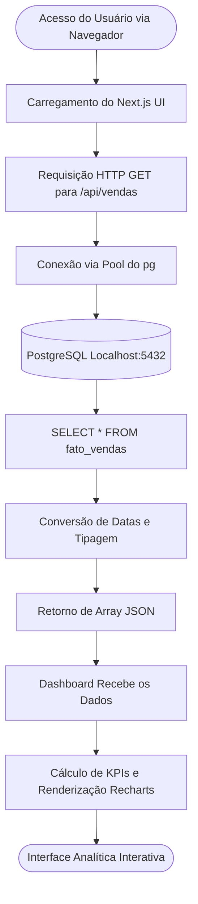

# <p align="center">Dashboard Analítico NogTech</p>
<p align="center">
  <strong>Projeto Final Disciplina de Práticas Profissionais em Big Data</strong><br>
  7° Periodo | Engenharia de Software | Unicatólica-TO
</p>

## Integrantes
- João Victor Ferreira Costa
- Eville Vitória Nunes Coelho
- Fernanda Galvão Marçal
- Keven Lucas Rodrigues

## Descrição do Projeto

Este repositório contém o frontend (Dashboard) desenvolvido para apoiar a análise da diretoria da NogTech. A aplicação web consome exclusivamente os dados da camada fato gerada pelo pipeline de ETL, garantindo que as informações apresentadas estejam totalmente tratadas, enriquecidas e em conformidade com a LGPD (anonimizadas).

---

## Stack Tecnológica Escolhida

Para garantir uma interface rápida, responsiva e de fácil manutenção, a equipe optou pelo seguinte ecossistema:

* **Next.js (App Router):** Framework React para renderização da interface e criação da API backend na mesma base de código.
* **Tailwind CSS:** Framework de estilização utilitária para um design moderno e responsivo sem arquivos CSS complexos.
* **Recharts:** Biblioteca focada em visualização de dados para criação dos gráficos de linha e barras.
* **Lucide React:** Pacote de ícones vetoriais leves.
* **Node-Postgres (`pg`):** Driver de conexão direta com o banco de dados PostgreSQL.

---

## Estrutura do Projeto

```text
painel-nogtech/
│
├── app/
│   ├── api/vendas/route.ts
│   ├── globals.css
│   ├── layout.tsx
│   └── page.tsx
│
├── public/
├── package.json
├── tailwind.config.ts
└── README.md

```

---

## Instruções de Inicialização do Ambiente

### Pré-requisitos

Antes de iniciar este projeto, certifique-se de que o **pipeline de ETL (Airflow + PostgreSQL)** já esteja rodando na sua máquina. Além disso, é necessário ter instalado:

* Node.js (versão 18+ recomendada);
* npm (Gerenciador de pacotes do Node);
* Git.

---

### 1. Clonar o repositório

```bash
git clone https://github.com/joao-fcosta/painel-nogtech.git
cd painel-nogtech

```

---

### 2. Instalar as dependências

Execute o comando abaixo na raiz do projeto para baixar todas as bibliotecas necessárias (Next.js, Recharts, Tailwind, etc):

```bash
npm install

```

---

### 3. Subir o ambiente de desenvolvimento

Certifique-se de que o PostgreSQL do projeto ETL esteja ativo na porta 5432 e execute:

```bash
npm run dev

```

O Next.js irá compilar o projeto e iniciar o servidor web.

---

## Portas de Acesso e Credenciais

A interface visual do Dashboard pode ser acessada pelo navegador no endereço padrão do Next.js:

| Serviço | Porta | Endereço |
| --- | --- | --- |
| Aplicação Web (Next.js) | 3000 | http://localhost:3000 |
| API Interna (Busca de Dados) | 3000 | http://localhost:3000/api/vendas |

A aplicação se conecta de forma automática ao banco de dados do projeto de Engenharia de Dados usando as seguintes credenciais nativas da rota da API:

* **Host:** localhost
* **Porta:** 5432
* **Database:** airflow
* **Usuário:** airflow
* **Senha:** airflow

---

## Funcionalidades do Dashboard

O painel foi estruturado para fornecer as respostas estratégicas solicitadas pela diretoria, contendo:

* **Filtros Interativos:** Permite o recorte de dados por Período (Mês) e Localização (Estado/UF).
* **Cartões de KPI (Indicadores-chave):** Exibição em tempo real do Total de Vendas, Receita Total, Ticket Médio, Média de Horas Assistidas e NPS Médio.
* **Análise Temporal:** Gráfico de linhas demonstrando a evolução da receita ao longo dos meses.
* **Análise Geográfica:** Gráfico de barras verticais organizando o volume de receita por unidade federativa.
* **Auditoria LGPD:** Tabela de exibição de amostra dos lotes, comprovando a eficácia da máscara de CPFs e remoção de nomes da base de dados consumida.

---

## Resumo Analítico dos Resultados

Através da interface construída com os dados higienizados, foi possível extrair os seguintes insights principais:

* O Ticket Médio é impulsionado significativamente pelas aquisições anuais da plataforma (R$ 899,00).
* A análise demográfica mostra forte adesão na região de Tocantins, convertida através das coordenadas geográficas enriquecidas via BrasilAPI.
* A retenção de alunos (baseada no cruzamento de NPS e Horas Assistidas) mantém níveis consistentes de engajamento, mesmo validando filtros que separam dias úteis de feriados nacionais.

---

## Desenho da Arquitetura do Painel

O fluxo de funcionamento do painel segue o modelo de renderização com chamadas via API nativa:

